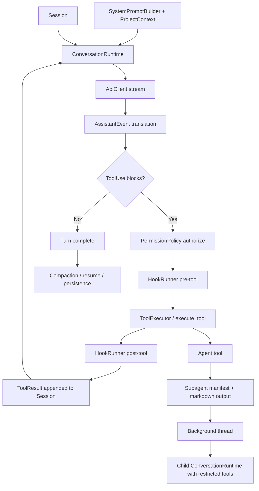

# Agent Framework Architecture Brief

Derived from internal source material created during a framework extraction pass over an open-source agent runtime and orchestration codebase. This public-safe copy preserves the original structure while omitting private repo-path assumptions from surrounding notes.

## Purpose

This brief extracts the framework shape that can be reused for agent-team development from two layers in this repository:

- the inner runtime harness implemented in Rust
- the outer development orchestration described in the repo docs

The goal is not to describe every subsystem. The goal is to isolate the framework primitives that should survive a port into another stack.

## Evidence Boundary

Use this evidence hierarchy when making design decisions:

1. Runtime code wins over narrative docs.
2. `README.md` defines the documented OmX-assisted workflow.
3. `PARITY.md` is useful for boundaries and missing-surface analysis, but parts of it are stale relative to the current code.

Two concrete examples of source drift:

- `PARITY.md` says Rust lacks a hook execution pipeline, but `ConversationRuntime` currently runs pre-tool and post-tool hooks in the main loop.
- `PARITY.md` says plugins are absent in Rust, but the Rust workspace now contains a `plugins` crate with manifests, permissions, hooks, commands, lifecycle data, and a `PluginManager`.

## Primary Source Anchors

Use these files as the anchor set for future review or extension:

| Source | Why it matters |
| --- | --- |
| `rust/crates/runtime/src/conversation.rs` | Defines the owning conversation loop, hook placement, tool execution sequencing, and stop conditions. |
| `rust/crates/runtime/src/prompt.rs` | Defines prompt layering, project context discovery, and instruction-file loading. |
| `rust/crates/runtime/src/session.rs` | Defines typed session state and structured message content. |
| `rust/crates/runtime/src/permissions.rs` | Defines permission modes, escalation, and authorization behavior. |
| `rust/crates/runtime/src/compact.rs` | Defines compaction, summary shape, and direct-resume continuation behavior. |
| `rust/crates/tools/src/lib.rs` | Defines the `Agent` tool, subagent role mapping, manifest persistence, and restricted child runtimes. |
| `rust/crates/commands/src/lib.rs` | Defines agent and skill discovery roots, precedence, and shadowing behavior. |
| `rust/crates/claw-cli/src/main.rs` | Shows how the runtime, plugins, slash commands, and operator surface are wired together. |
| `rust/crates/plugins/src/lib.rs` | Defines plugin manifests, permissions, hooks, commands, lifecycle metadata, and plugin manager surfaces. |
| `README.md` | Documents the OmX-assisted outer workflow and the `$team` / `$ralph` patterns. |
| `PARITY.md` | Describes intended architecture boundaries and missing parity, but should be treated as secondary to current code. |

## Layer Model

### Layer 1: Inner Harness

The inner harness is the runtime architecture implemented in Rust. Its center of gravity is a single conversation loop that:

1. builds a model request from a system prompt and session history
2. streams assistant output into structured events
3. extracts tool invocations from assistant output
4. applies permission policy
5. runs pre-tool and post-tool hooks
6. executes tools
7. appends tool results back into session state
8. repeats until the assistant emits no more tool calls

This is the reusable kernel for a multi-agent coding system.

### Layer 2: Outer Workflow

The outer workflow is not encoded as a first-class runtime subsystem in this repo. It is documented in `README.md` as an OmX-driven execution model:

- `$team` for coordinated parallel review and architectural feedback
- `$ralph` for persistent execution loops and architect-level verification
- cleanroom passes before publish
- manual and live validation before release

This is the reusable operator model around the runtime.

## System Map

## Observed Runtime Components

| Primitive | Current implementation | Observed behavior | Reusable takeaway |
| --- | --- | --- | --- |
| Prompt assembly | `rust/crates/runtime/src/prompt.rs` | Builds a layered system prompt, appends environment context, project context, config, and discovered instruction files. | Treat instruction loading as a first-class runtime concern, not a prompt hack. |
| Session model | `rust/crates/runtime/src/session.rs` | Stores a versioned session with explicit roles and structured content blocks for text, tool use, and tool results. | Model the conversation as durable typed state, not raw transcript text. |
| Conversation loop | `rust/crates/runtime/src/conversation.rs` | Runs the assistant-tool loop until no pending tool calls remain or max iterations is exceeded. | Make one orchestrator loop own all request, tool, and continuation decisions. |
| Permission gate | `rust/crates/runtime/src/permissions.rs` | Evaluates tool calls against active mode and per-tool required mode, with prompting for escalations. | Permissions belong in policy objects, not scattered in tools. |
| Hook pipeline | `rust/crates/runtime/src/conversation.rs`, `rust/crates/plugins/src/lib.rs` | Pre-tool hooks can deny calls; post-tool hooks can annotate or deny results. | Add policy and telemetry extension points around tool execution, not inside each tool. |
| Compaction and resume | `rust/crates/runtime/src/compact.rs` | Summarizes older history into a system continuation message while preserving recent messages verbatim. | Compression must preserve resumability, pending work, and key files. |
| Subagent delegation | `rust/crates/tools/src/lib.rs` | The `Agent` tool creates a durable task record, spawns a background job, and runs a child runtime with a role-specific tool subset. | Delegation should be explicit, durable, and bounded by role-specific capability sets. |
| Agent and skill discovery | `rust/crates/commands/src/lib.rs` | Searches project and user roots for agent and skill definitions, then applies source precedence and shadowing. | Make local overrides and discovery precedence explicit. |
| CLI integration | `rust/crates/claw-cli/src/main.rs` | Wires prompt mode, REPL mode, slash commands, plugins, tools, and runtime into one operator-facing binary. | Keep the operator surface thin; the runtime should stay independently reusable. |

## Current Runtime Details Worth Reusing

### Prompt and Context Assembly

`SystemPromptBuilder` composes the prompt from fixed sections, environment data, project context, runtime config, and appended sections. `ProjectContext` discovers instruction files by walking ancestor directories and loading:

- `CLAW.md`
- `CLAW.local.md`
- `.claw/CLAW.md`
- `.claw/instructions.md`

Framework takeaway: treat local instructions as layered policy and context inputs. Do not hardcode one file path or assume a single global prompt.

### Session As Typed State

The runtime stores messages as structured objects with:

- role: `system`, `user`, `assistant`, or `tool`
- blocks: `text`, `tool_use`, or `tool_result`
- optional usage metadata

Framework takeaway: multi-agent orchestration needs typed session state so tools, compaction, resume, and audits can operate on structure instead of string heuristics.

### The Conversation Loop

`ConversationRuntime::run_turn` is the core orchestration loop. It:

1. appends the user input to session state
2. submits `system_prompt + messages` to the API client
3. converts assistant events into an assistant message
4. finds pending tool uses in the assistant message
5. appends the assistant message to session state
6. authorizes and executes each tool call
7. appends tool results to session state
8. repeats until the assistant stops issuing tool calls

Framework takeaway: keep orchestration centralized. Do not let tools recurse into ad hoc model calls or create side loops unless they are explicitly modeled as child runtimes.

### Permission and Hook Governance

Permission decisions are handled by `PermissionPolicy`, which separates:

- the active runtime mode
- the required mode for each tool
- the optional prompting path for escalations

Hook execution is integrated into the loop:

- pre-tool hooks can deny execution before the tool runs
- post-tool hooks can attach feedback or convert the result into an error

Framework takeaway: governance should wrap tool execution, not live inside tool implementations.

### Compaction and Resume

Compaction in `rust/crates/runtime/src/compact.rs` does more than shorten history. It preserves:

- recent messages verbatim
- key files referenced
- recent user requests
- pending work
- a direct resume instruction so the assistant continues without recap

Framework takeaway: compaction is part of orchestration quality, not a storage optimization. Summaries must preserve execution intent.

### Delegation Through the Agent Tool

The `Agent` tool is the most reusable framework element in the repo. It does five important things:

1. validates delegated work has a non-empty description and prompt
2. normalizes a role label into a subagent type
3. derives an allowlist of tools from the role
4. writes a durable markdown task file plus a JSON manifest
5. spawns a background job that runs a child `ConversationRuntime`

This creates a durable handoff contract with:

- identity
- role
- prompt
- allowed tools
- model choice
- output file
- manifest file
- completion or failure state

Framework takeaway: delegation should be explicit work packaging, not just "ask another model instance."

## Role and Capability Model Observed In Code

The current code already encodes a role-to-tool-budget mapping:

| Repo subagent type | Primary use | Observed tool pattern | Reusable role |
| --- | --- | --- | --- |
| `Explore` | read-only tracing and evidence gathering | file search, web, tool search, skill, structured output; no shell or write tools | Explorer |
| `Plan` | planning and operator communication | read-only tools plus todo writing, structured output, user messaging | Planner |
| `Verification` | execution checks and verification | shell, read-only tools, todo writing, structured output, messaging, PowerShell; no file writes | Verifier |
| `general-purpose` | broad execution | shell, read/write/edit, search, notebook, config, sleep, messaging | General worker |

Framework takeaway: role design becomes concrete when each role has a capability budget, not just a name.

## Discovery and Override Model

Agent and skill discovery both follow a layered source model:

- project `.codex/*`
- project `.claw/*`
- `CODEX_HOME/*`
- user `~/.codex/*`
- user `~/.claw/*`

The commands layer also tracks shadowing so higher-precedence definitions override lower-precedence ones without silently deleting them.

Framework takeaway: if your agent team supports custom roles or skills, define override precedence up front. Hidden precedence becomes an operational bug later.

## Documented Outer Workflow

`README.md` describes an OmX-assisted development workflow with four durable patterns:

1. parallel review and architecture feedback via `$team`
2. persistent execution via `$ralph`
3. cleanroom QA and validation passes before release
4. manual and live verification before publication

These patterns are not implemented as first-class OmX runtime code in this repo. They should be treated as documented workflow patterns, not observed runtime mechanics.

## Reusable Framework Primitives

The framework primitives worth porting are:

- layered instruction loading
- typed session state
- one owning orchestrator loop
- permission policy as a first-class subsystem
- pre-tool and post-tool governance hooks
- durable compaction and direct-resume summaries
- explicit delegation artifacts
- role-based tool budgets
- local override and discovery precedence
- separate operator workflow for review, verification, and release

## Non-Portable Or Repo-Specific Details

Do not treat these as framework requirements:

- hardcoded model names and dates
- exact file names under `.claw-agents`
- the current CLI flag surface
- current plugin marketplace naming
- OmX mode names themselves

Port the pattern, not the literal strings.

## Architecture Conclusions

The inner harness is a single-loop agent runtime with governed tool execution and explicit delegation. The outer workflow is a disciplined operator model that adds parallel review, persistent execution, and verification gates around that runtime.

That combination is the framework to reuse:

- inner harness for execution correctness
- outer workflow for team-level reliability
